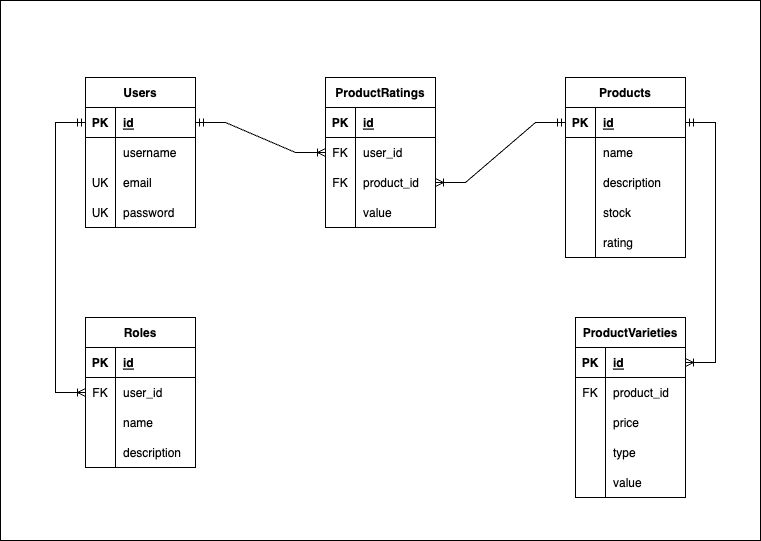

# Product API
## Description

Product API adalah backend API service yang dibangun menggunakan NestJS untuk mengelola informasi produk. 
API ini menyediakan fungsionalitas :
- management data product
- management data product varieties
- management product rating
- managament user 
- management user role


## Data Diagram
Berikut merupakan data diagram dari product api
```
model Users {
  id              Int     @default(autoincrement())   @id
  username        String @unique
  email           String @unique
  password        String
}

model Roles {
  id          Int @default(autoincrement()) @id
  user_id     Int
  name        String
  description String
}

model Products {
  id                    Int                     @default(autoincrement()) @id
  name                  String
  description           String                  @db.Text
  stock                 Int
  rating                Float                   @default(0)
}

model ProductVarieties {
  id          Int       @default(autoincrement()) @id
  product_id  Int
  type        String
  value        String
  price       Float
}

model ProductRatings {
  id          Int   @default(autoincrement()) @id
  user_id     Int
  product_id  Int
  value       Float
}
```



## Cara Install
### Aplikasi yang harus terinstal di local
- git
- docker
- node

### Git Clone
```bash
# git clone repo suryadaren/product
$ git clone https://github.com/suryadaren/product.git

# masuk ke direktori project
$ cd prduct

# copy paste env
$ cp .env-copy .env

#update env
$ cat .env 
```

### Run Container
```bash
# jalankan container dengan docker compose
$ docker compose up --build -d
```


## Cara Penggunaan
- doc api akses melalui browser "http://localhost:3000/api/docs"
- import postman collection (./docs/postmanCollection)
- Akses API melalui postman yang sudah di import
- lakukan register user (api/v1/auth/register)
- untuk mengakses api, harus melakukan login (api/v1/auth/login)
- jadikan user sebagai admin agar bisa mengakses api lain (api/v1/users/admin/set-admin)
- input manual ke db, input data
- untuk menginput data dummy akses folder (api/v1/seed) di postman (depends on : register user as user role)
- anda bisa mengakses semua api berdasarkan roles user
  * roles admin tidak bisa mengakses input rating
  * roles user tidak bisa mengakses api post, put, delete (kecuali api create rating, delete rating, update password)